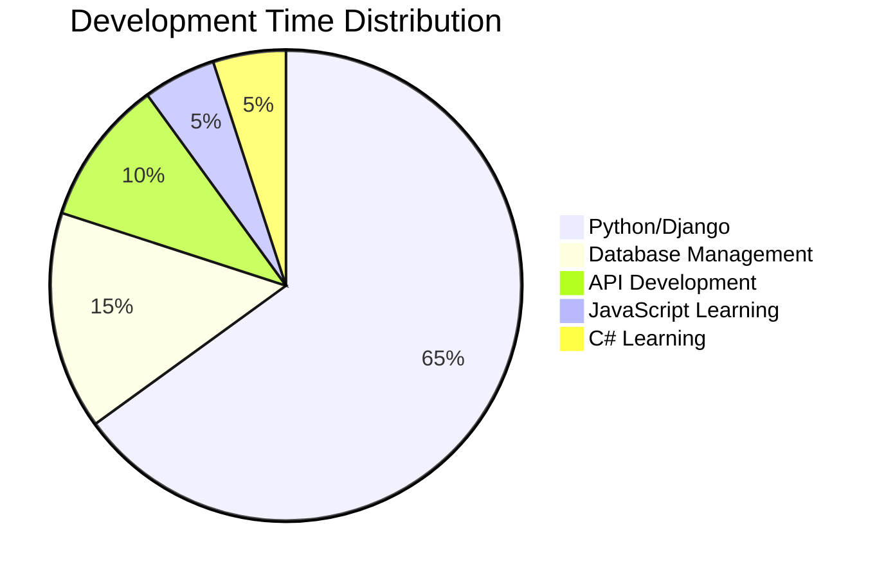

<div align="center">

# ⚡️ Alireza Rezaeifard | Backend Developer ⚡️

[](https://git.io/typing-svg)

<div align="center">
  <a href="https://discord.gg/_pashmam">
    
  </a>
  <a href="https://instagram.com/symphony______no9">
    
  </a>
  <a href="https://twitter.com/unknown______81">
    
  </a>
</div>

<div align="center">
  
  
</div>

</div>

## 💫 Professional Summary

```python
class BackendDeveloper:
    def __init__(self):
        self.name = "Alireza Rezaeifard"
        self.birth = "June 28, 2002"
        self.role = "Backend Developer"
        self.location = "Iran 🇮🇷"
        self.education = "Computer Science"
        
    @property
    def tech_stack(self):
        return {
            "languages": ["Python", "JavaScript", "C#"],
            "frameworks": ["Django", "DRF", "FastAPI"],
            "databases": ["MySQL", "SQLite", "PostgreSQL"],
            "tools": ["Git", "REST APIs", "Docker"],
            "principles": ["Clean Code", "SOLID", "DRY"]
        }
    
    @property
    def current_focus(self):
        return [
            "Building Scalable Web Applications",
            "API Development & Integration",
            "Database Optimization",
            "System Architecture Design"
        ]

    def get_experience(self):
        return """
        Passionate backend developer with expertise in Python and Django.
        Focused on creating efficient, scalable, and maintainable solutions.
        Committed to continuous learning and professional growth.
        """
```

## 🛠️ Technology Stack

<div align="center">

### 🔥 Primary Stack
[](https://python.org)
[](https://www.djangoproject.com/)
[](https://www.mysql.com/)
[](https://www.sqlite.org/)

### 📚 Learning & Growth
[](https://javascript.com)
[](https://docs.microsoft.com/en-us/dotnet/csharp/)
[](https://git-scm.com/)
</div>

## 📊 GitHub Analytics

<div align="center">
   
  
</div>

### 📈 Contribution Metrics


### 🏆 GitHub Trophies


## 💻 Weekly Development Breakdown



## 🎯 Professional Goals 2024

### Immediate Focus
- 🔧 Advanced Django REST Framework Implementations
- 📊 Database Performance Optimization
- 🌐 API Security & Authentication Systems
- 🎓 Computer Science Degree Progress

### Future Aspirations
- 🚀 Full-Stack Development Capabilities
- 🔍 Microservices Architecture
- 🌱 Cloud Infrastructure Integration
- 📚 Technical Blog Writing

## 💡 Expertise Areas

- 🔹 Backend Development
- 🔹 RESTful API Design
- 🔹 Database Architecture
- 🔹 System Integration
- 🔹 Code Optimization
- 🔹 Version Control

## 🌟 Professional Journey

```text
Python/Django    ██████████████████████░░   90%
REST APIs        ████████████████████░░░░   85%
Database Design  ███████████████████░░░░░   80%
Git & DevOps     ████████████████░░░░░░░░   70%
JavaScript       ████████░░░░░░░░░░░░░░░░   35%
C#               ██████░░░░░░░░░░░░░░░░░░   25%
```

<div align="center">

## 🤝 Let's Connect and Collaborate!

<p>I'm always interested in:</p>

- 🤖 Backend Development Projects
- 🌐 API Integration Challenges
- 📚 Knowledge Sharing
- 🎯 Code Review & Optimization
- 🔄 Open Source Contributions

### 📫 Reach Out

<a href="https://discord.gg/_pashmam">
  
</a>
<a href="https://instagram.com/symphony______no9">
  
</a>
<a href="https://twitter.com/unknown______81">
  
</a>

---

<div align="center">
  
  
  ### "Clean code always looks like it was written by someone who cares." 
</div>


</div>

<!--
Last Updated: November 2024
Always learning, always growing! 🌱
-->
